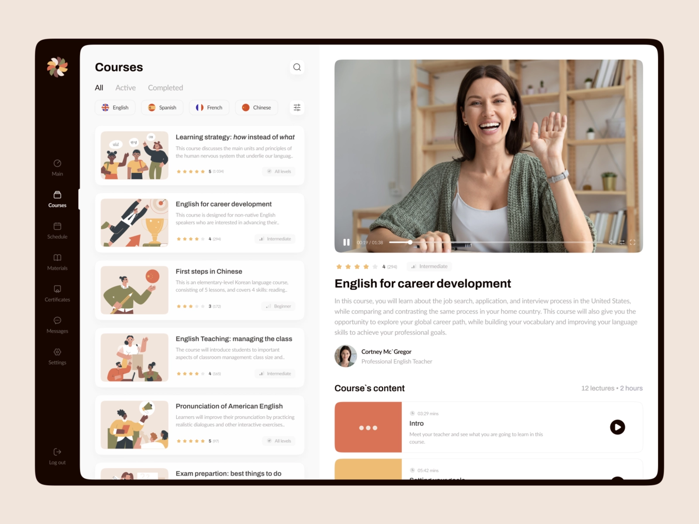

# Notes or Concerns

- I think of the dashboard as a module that will be consumed from a bigger web-app. Because of that, I will not be doing the part of the sidebar with routing to different pages.
- Commonly I would have a Figma design (or a design in some similar platform) where I could get the exact colours, fonts and size for the design, so I could keep the pixel perfect technique. In this case, I will try the best approach.
- The filter button at the right of language is quite not defined in what should show inside there, I will define that as a modal prompt displaying current filters allowing to remove them.
- It is missing some information in the course status (for the “All-Active-Completed”). I define that Active refers to courses that have been started but not completed.
- In the getCourses request, I will add the filter logic in an async function to represent what backed would do, with that I will be able to build filter feature
- For text filter I will only look for matches in courses names.
- On course detail it will be displayed the preview Image of the course and the list of the content.
- The list of content would redirect to another page. That page will not be done as there is no definition.

## Roadmap 
Here you can see the [Roadmap](https://github.com/julian916/web-courses-dashboard/wiki/Roadmap) of the steps followed and the state of each

## Design

------

# How to run this webapp

This project was bootstrapped with [Create React App](https://github.com/facebook/create-react-app).
Plus Typescript and ESLint.

## Available Scripts

In the project directory, you can run:

### `npm install` (**Do this before running the webapp**)

Download and install all node modules.

### `npm start`

Runs the app in the development mode.\
Open [http://localhost:3000](http://localhost:3000) to view it in the browser.

The page will reload if you make edits.\
You will also see any lint errors in the console.

### `npm test`

Launches the test runner in the interactive watch mode.\

### `npm run build` (WORK IN PROGRESS)

Builds the app for production to the `build` folder.\
It correctly bundles React in production mode and optimizes the build for the best performance.

The build is minified and the filenames include the hashes.\
Your app is ready to be deployed!

